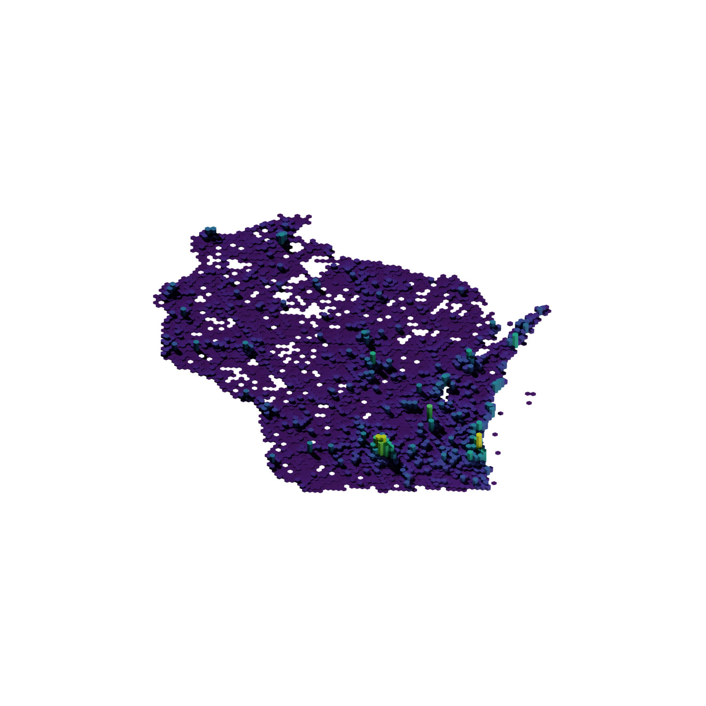
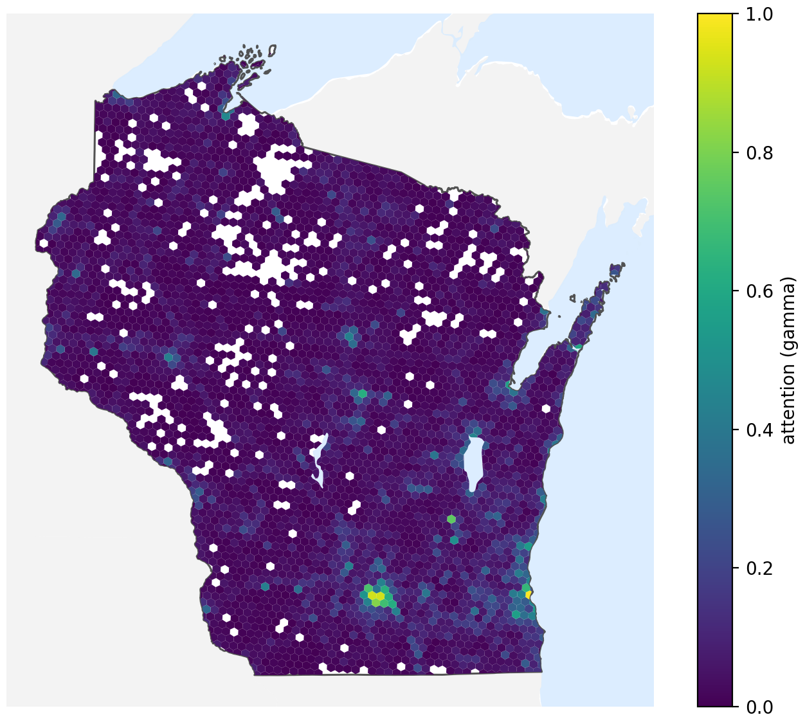
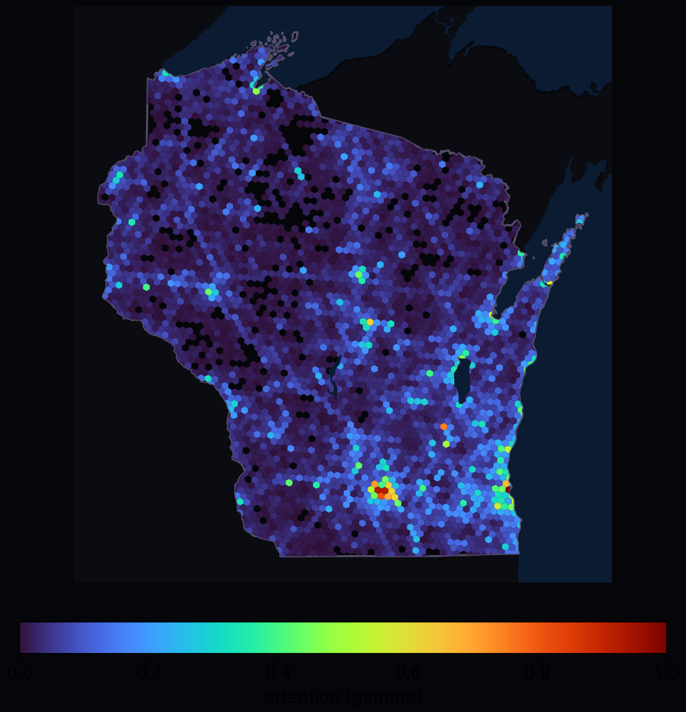
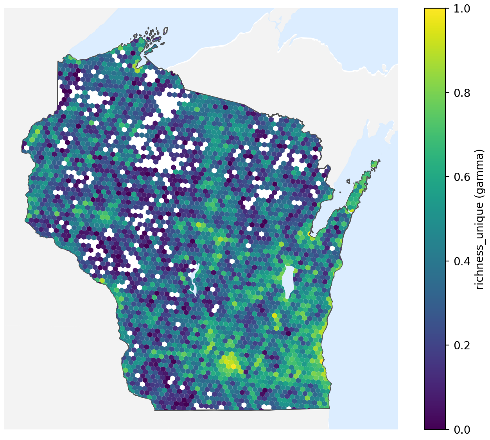
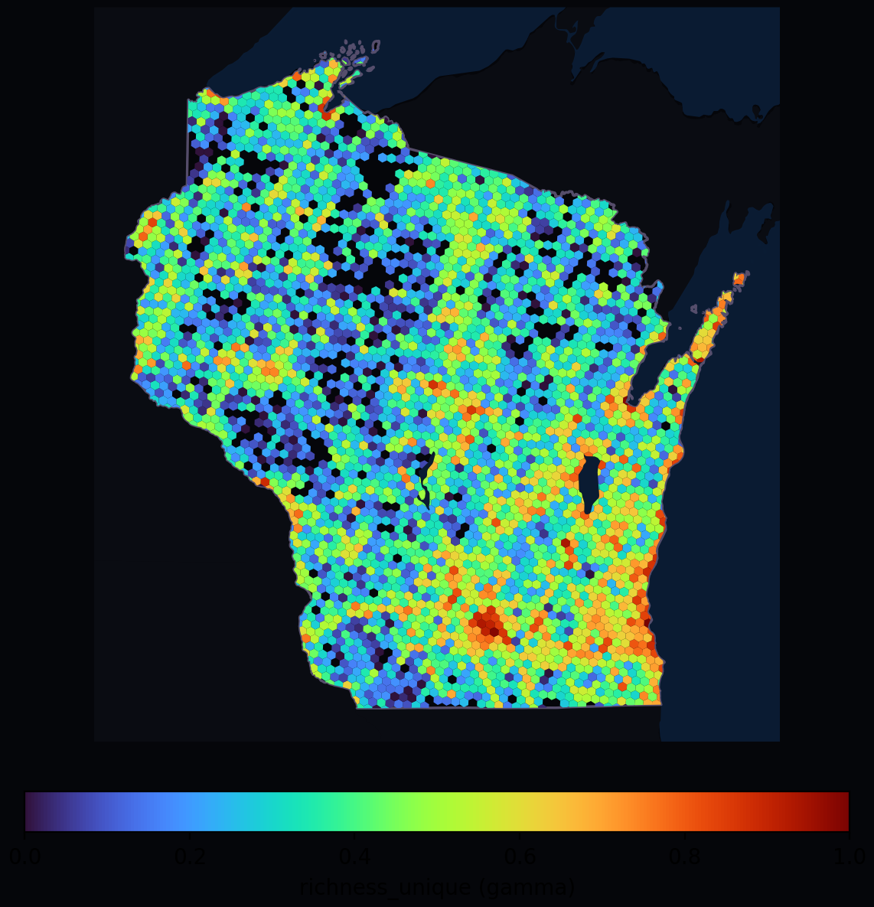
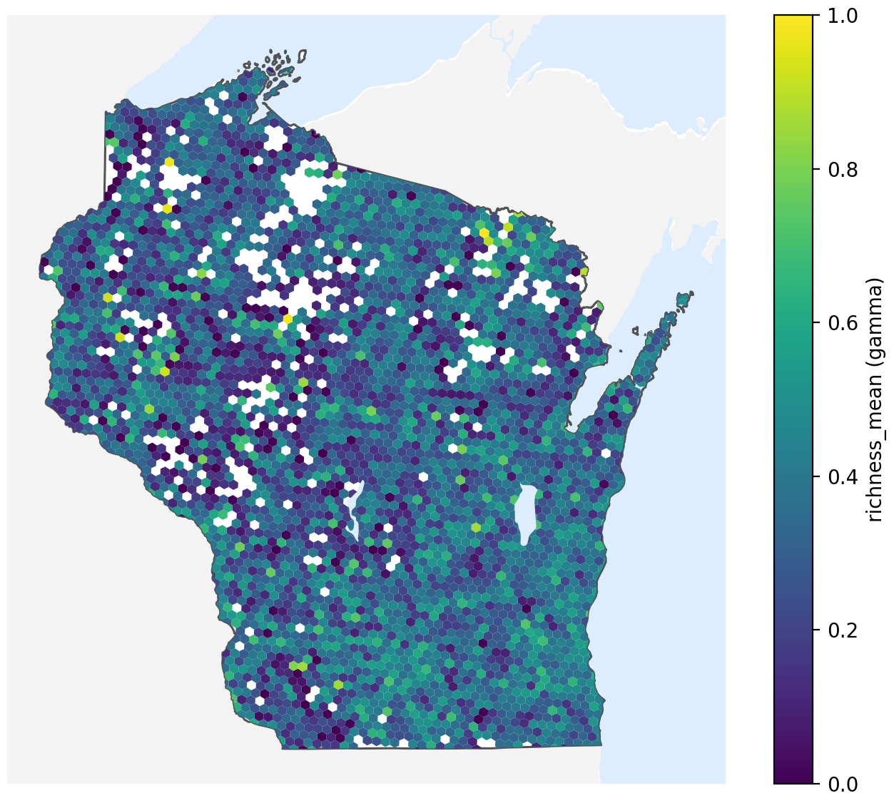
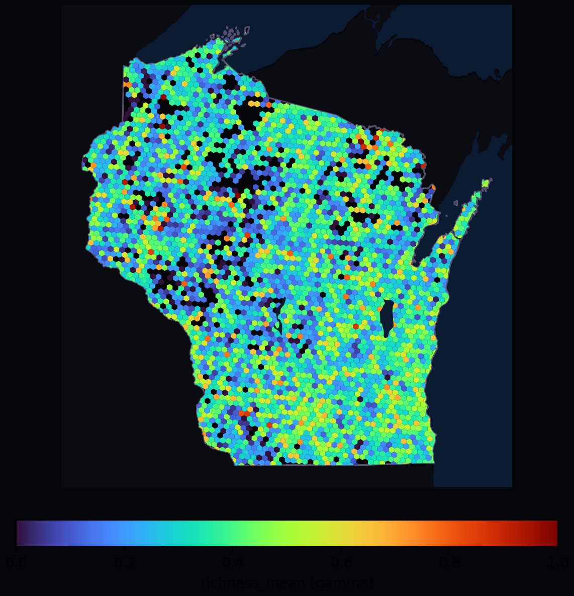

# surface-mapper
[](https://github.com/pkesling/surface-mapper/actions/workflows/ci.yml)
[](LICENSE)

Build geospatial analysis surfaces from observation/event data, then render publication-ready maps.

Project links: [Changelog](CHANGELOG.md) · [Contributing](CONTRIBUTING.md) · [License](LICENSE)

## About SurfaceMapper
SurfaceMapper is a geospatial rendering workflow for producing high-quality analytical and artistic map outputs from event or observation data with minimal setup. It focuses on consistent pipeline steps: ingest data, build surface metrics, attach boundary/water context, and render outputs with preset-driven styling.

The tool is built for reproducibility and low-friction iteration, with composable inputs across CLI flags, config, and presets. The same workflow supports fast experiments and repeatable production runs, with outputs that can be regenerated from versioned data, parameters, and render settings.

## Quick Start
1. Install dependencies and CLI:
```bash
uv sync
```

2. Ingest your source data into normalized DuckDB tables (example: eBird EBD TSV):
```bash
surface-mapper ingest ebird-ebd --obs path/to/observations.tsv --sampling path/to/sampling.tsv --out data/surfaces.duckdb
```

3. Build a surface metric:
```bash
surface-mapper surface --db data/surfaces.duckdb --dataset ebird-ebd --metric attention --res 6
```

4. Fetch default region/lakes files for rendering:
```bash
surface-mapper geodata fetch-defaults --state WI
```

5. Render a PNG:
```bash
surface-mapper render flat \
  --db data/surfaces.duckdb \
  --dataset ebird-ebd \
  --metric attention \
  --res 6 \
  --rotate-deg -3.0 \
  --region-file data/geodata/default/derived/WI_boundary.geojson \
  --neighbors-file data/geodata/default/derived/WI_neighbors.geojson \
  --water-file data/geodata/default/derived/WI_lakes.geojson \
  --mask-water \
  --preset classic \
  --out outputs/attention.png
```

## Recommended Workflow
1. `ingest` source files into normalized tables.
2. `surface` to compute metric tables (`surface_cells`).
3. `geodata fetch-defaults` (or provide your own region/water files).
4. `render flat` for PNG outputs.
5. `export surface` for parquet outputs.

## One-Command Pipeline
For a low-friction end-to-end run (ingest -> surface -> render), use:
```bash
surface-mapper run \
  --dataset ebird-ebd \
  --obs data/ebd_observations.tsv \
  --sampling data/ebd_sampling.tsv \
  --out outputs/quickstart.png
```

Defaults:
- output type: `flat`
- metric: `attention`
- resolution: `6`
- preset: `classic`
- temporary DuckDB is cleaned up automatically (use `--keep-artifacts` to keep it)
- for `--dataset ebird-ebd`, `--sampling` is required in `run` mode

---

## Installation
### Requirements
- Python 3.11+
- `uv` recommended

### Install
```bash
uv sync
```

### CLI help
```bash
surface-mapper --help
surface-mapper ingest --help
surface-mapper surface --help
surface-mapper render flat --help
surface-mapper geodata --help
```

---

## Ingest Data
Current built-in adapter:
- `ebird-ebd` (aliases: `ebird`, `ebd`)

Example:
```bash
surface-mapper ingest ebird-ebd \
  --obs data/ebd_observations.tsv \
  --sampling data/ebd_sampling.tsv \
  --out data/surfaces.duckdb
```

Notes:
- Ingest writes normalized tables (`normalized_observations`, `normalized_events`).
- Ingest does not build surface metrics; run `surface` after ingest.

---

## Build Surface Metrics
Example (single slice):
```bash
surface-mapper surface \
  --db data/surfaces.duckdb \
  --dataset ebird-ebd \
  --metric attention \
  --res 6
```

Seasonal build (required before `--time-slice` render):
```bash
surface-mapper surface \
  --db data/surfaces.duckdb \
  --dataset ebird-ebd \
  --metric attention \
  --res 6 \
  --seasonal
```

Metrics:
- `attention`
- `richness_unique`
- `richness_mean`

---

## Geodata
Default boundary/water files used by rendering are downloaded via CLI and are not committed.

### Geodata contract
- SurfaceMapper does not manage boundary/water resolution in the renderer.
- Rendered fidelity equals input fidelity.
- If you want more shoreline/island detail, provide higher-fidelity files via `--region-file` / `--water-file`.
- `geodata fetch-defaults` is convenience bootstrap data for fast setup.
- Water layers are clipped to the active map view at render time so frame edges stay visually consistent.
- Default derived lakes are clipped to a padded boundary+neighbors extent so water context remains consistent with neighbor land framing.

### Fetch defaults
```bash
surface-mapper geodata fetch-defaults
```

### Show default sources and usage guidance
```bash
surface-mapper geodata show-defaults
```

### Fetch with custom state/output settings
```bash
surface-mapper geodata fetch-defaults \
  --state WI \
  --derived-dir data/geodata/default/derived \
  --crs EPSG:5070
```

### Typical layout
```text
data/geodata/default/
  states/
    cb_2024_us_state_5m.shp
    ...
  lakes/
    ne_10m_lakes.shp
    ...
  derived/
    WI_boundary.geojson
    WI_boundary_wgs84.geojson
    WI_neighbors.geojson
    WI_lakes.geojson
```

Boundary derivation preserves source geometry fidelity (no simplify step), so small source parts/islands are retained.

### Want more detail?
- Use higher-fidelity boundary sources and pass them to `--region-file`.
- Use alternative hydrography/water sources and pass them to `--water-file`.
- SurfaceMapper renders whatever geometry files you provide.

For Census state boundaries, choose your preferred resolution in the Census cartographic boundary "States" section and download the shapefile package:
- https://www.census.gov/geographies/mapping-files/time-series/geo/cartographic-boundary.html

By default, `surface-mapper geodata fetch-defaults` uses the `5M - 1:5,000,000 (national)` states shapefile package as a practical balance between file size and map detail.

---

## Render Maps
### Single render
```bash
surface-mapper render flat \
  --db data/surfaces.duckdb \
  --dataset ebird-ebd \
  --metric attention \
  --res 6 \
  --rotate-deg -3.0 \
  --region-file data/geodata/default/derived/WI_boundary.geojson \
  --neighbors-file data/geodata/default/derived/WI_neighbors.geojson \
  --water-file data/geodata/default/derived/WI_lakes.geojson \
  --mask-water \
  --preset neon \
  --out outputs/attention_neon.png
```

### Seasonal slice render
```bash
surface-mapper render flat \
  --db data/surfaces.duckdb \
  --metric attention \
  --res 6 \
  --time-slice winter \
  --region-file data/geodata/default/derived/WI_boundary.geojson \
  --out outputs/attention_winter.png
```

Valid `--time-slice` values:
- `winter`
- `spring`
- `summer`
- `fall`

### Quad seasonal layout
```bash
surface-mapper render flat \
  --db data/surfaces.duckdb \
  --metric attention \
  --res 6 \
  --layout quad \
  --preset classic \
  --region-file data/geodata/default/derived/WI_boundary.geojson \
  --out outputs/attention_quad.png
```

### Presets
- Built-in: `classic`, `neon`
- Custom: `--preset-file path/to/preset.json`

### Output size and DPI
```bash
surface-mapper render flat \
  --db data/surfaces.duckdb \
  --metric attention \
  --res 6 \
  --region-file data/geodata/default/derived/WI_boundary.geojson \
  --width-px 2400 \
  --height-px 1600 \
  --dpi 240 \
  --out outputs/attention_hi_res.png
```

## Render 3D Exports
`render 3d` now normalizes XY by default so different regions import into Blender at a consistent scene scale.
This makes fixed camera and light rigs reusable across exports.

- Default: `--normalize-xy` (on)
- Opt out: `--no-normalize-xy` to keep geospatial XY units (`--scale-units m|km` plus optional centering)
- Z remains analytic extrusion (`scaled_value * height_scale * scale_factor * z_exaggeration`)

Example:
```bash
surface-mapper render 3d \
  --db data/surfaces.duckdb \
  --metric attention \
  --res 6 \
  --normalize-xy \
  --out outputs/attention.glb
```

## 3D Rendering (Blender)
Use the first-class Blender command to render a `.glb` through a `.blend` template in headless mode.

Requirements:
- Blender installed
- A template `.blend` file in `assets/blender/templates/`

Example:
```bash
surface-mapper render3d \
  --glb outputs/attention.glb \
  --out outputs/attention_blender.png \
  --preset default
```

Alias:
```bash
surface-mapper render blender \
  --glb outputs/attention.glb \
  --out outputs/attention_blender.png \
  --preset default
```

If Blender is not on `PATH`, pass it explicitly:
```bash
surface-mapper render3d \
  --glb outputs/attention.glb \
  --out outputs/attention_blender.png \
  --blender /Applications/Blender.app/Contents/MacOS/Blender
```

Notes:
- Runs Blender headless (`-b`) with the selected template preset.
- `default`, `classic`, and `neon` currently resolve to the same Blender template.
- `--template` overrides `--preset`.
- Use `--dry-run` to print the exact Blender command without executing it.

Example output (Blender template render):


## Example Runs (Metrics x Presets)
All examples below assume:
- `data/surfaces.duckdb` exists and contains built metrics
- default geodata is available in `data/geodata/default/derived/`
- eBird citation for these example outputs:
  `eBird Basic Dataset. Version: EBD_relJan-2026. Cornell Lab of Ornithology, Ithaca, New York. Jan 2026.`

### Attention + Classic
```bash
surface-mapper render flat \
  --db data/surfaces.duckdb \
  --dataset ebird-ebd \
  --metric attention \
  --res 6 \
  --rotate-deg -3.0 \
  --region-file data/geodata/default/derived/WI_boundary.geojson \
  --neighbors-file data/geodata/default/derived/WI_neighbors.geojson \
  --water-file data/geodata/default/derived/WI_lakes.geojson \
  --mask-water \
  --preset classic \
  --out docs/examples/images/attention_classic.png
```


### Attention + Neon
```bash
surface-mapper render flat \
  --db data/surfaces.duckdb \
  --dataset ebird-ebd \
  --metric attention \
  --res 6 \
  --rotate-deg -3.0 \
  --region-file data/geodata/default/derived/WI_boundary.geojson \
  --neighbors-file data/geodata/default/derived/WI_neighbors.geojson \
  --water-file data/geodata/default/derived/WI_lakes.geojson \
  --mask-water \
  --preset neon \
  --out docs/examples/images/attention_neon.png
```


### Richness Unique + Classic
```bash
surface-mapper render flat \
  --db data/surfaces.duckdb \
  --dataset ebird-ebd \
  --metric richness_unique \
  --res 6 \
  --rotate-deg -3.0 \
  --region-file data/geodata/default/derived/WI_boundary.geojson \
  --neighbors-file data/geodata/default/derived/WI_neighbors.geojson \
  --water-file data/geodata/default/derived/WI_lakes.geojson \
  --mask-water \
  --preset classic \
  --out docs/examples/images/richness_unique_classic.png
```


### Richness Unique + Neon
```bash
surface-mapper render flat \
  --db data/surfaces.duckdb \
  --dataset ebird-ebd \
  --metric richness_unique \
  --res 6 \
  --rotate-deg -3.0 \
  --region-file data/geodata/default/derived/WI_boundary.geojson \
  --neighbors-file data/geodata/default/derived/WI_neighbors.geojson \
  --water-file data/geodata/default/derived/WI_lakes.geojson \
  --mask-water \
  --preset neon \
  --out docs/examples/images/richness_unique_neon.png
```


### Richness Mean + Classic
```bash
surface-mapper render flat \
  --db data/surfaces.duckdb \
  --dataset ebird-ebd \
  --metric richness_mean \
  --res 6 \
  --rotate-deg -3.0 \
  --region-file data/geodata/default/derived/WI_boundary.geojson \
  --neighbors-file data/geodata/default/derived/WI_neighbors.geojson \
  --water-file data/geodata/default/derived/WI_lakes.geojson \
  --mask-water \
  --preset classic \
  --out docs/examples/images/richness_mean_classic.png
```


### Richness Mean + Neon
```bash
surface-mapper render flat \
  --db data/surfaces.duckdb \
  --dataset ebird-ebd \
  --metric richness_mean \
  --res 6 \
  --rotate-deg -3.0 \
  --region-file data/geodata/default/derived/WI_boundary.geojson \
  --neighbors-file data/geodata/default/derived/WI_neighbors.geojson \
  --water-file data/geodata/default/derived/WI_lakes.geojson \
  --mask-water \
  --preset neon \
  --out docs/examples/images/richness_mean_neon.png
```



### Rotation
- `--rotate-deg` rotates all render layers together (region, neighbors, water, hexes) for aesthetic composition.
- Start with small values for WI, such as `-2.0` to `-3.0`.

---

## Export Surfaces
Export computed surface table to parquet:
```bash
surface-mapper export surface --db data/surfaces.duckdb --out outputs/surface_cells.parquet
```

---

## Persistent CLI Config
Use JSON config to avoid repeating options:

```json
{
  "render": {
    "flat": {
      "db": "data/surfaces.duckdb",
      "dataset": "ebird-ebd",
      "metric": "attention",
      "res": 6,
      "preset": "neon",
      "rotate_deg": -2.5,
      "region_file": "data/geodata/default/derived/WI_boundary.geojson",
      "neighbors_file": "data/geodata/default/derived/WI_neighbors.geojson",
      "water_file": "data/geodata/default/derived/WI_lakes.geojson",
      "mask_water": true,
      "out": "outputs/attention.png"
    }
  }
}
```

Run with:
```bash
surface-mapper render flat --config config.json
```

If `--config` is omitted, SurfaceMapper auto-loads `./config.json` when present.
If no local config exists, it falls back to `~/.config/surface-mapper/config.json`.

Resolution order:
1. preset defaults
2. config values
3. CLI flags

---

## Logging
Global log level can be set by:
- CLI: `--log-level DEBUG`
- Env var: `SURFACE_MAPPER_LOG_LEVEL=DEBUG`

Example:
```bash
surface-mapper --log-level DEBUG geodata fetch-defaults --force
```

---

## Common Issues
### `No surface rows matched query ... time_slice=winter`
You likely built non-seasonal surfaces only. Rebuild with:
```bash
surface-mapper surface --db data/surfaces.duckdb --dataset ebird-ebd --metric attention --res 6 --seasonal
```

### `Missing --region-file`
Renderer requires user-provided region geometry.
Use:
```bash
surface-mapper geodata fetch-defaults
```
Then pass `--region-file` (or set it in config).

### DuckDB lock error
If another process (for example an IDE DB browser) holds the DB lock, close that connection and retry.

---

## License & Data
- This project is licensed under the [MIT License](LICENSE).
- Generated outputs (images, models, exported meshes, and derived visuals) are owned by the user who generated them.
- This project does not redistribute third-party datasets.
- U.S. Census TIGER/Cartographic Boundary files are public domain.
- Natural Earth data is public domain.
- eBird citation: `eBird Basic Dataset. Version: EBD_relJan-2026. Cornell Lab of Ornithology, Ithaca, New York. Jan 2026.`
- If you use eBird datasets, you are responsible for complying with eBird data usage terms.
